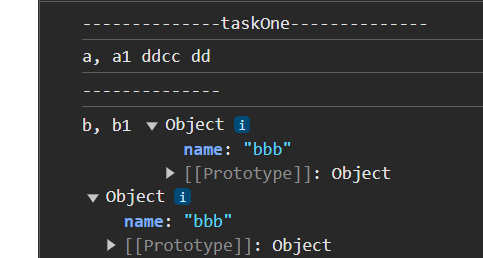

## Вопрос №1

### Вопрос

1) Есть ли множественнео наследование в ts?
2) Есть ли перегрузка методов в ts?
3) Какие бывают типы данных в js?
4) Как вы работаете с датами?

### Ответ

1) [Хранение по ссылке и по значению](https://doka-guide.vercel.app/js/ref-type-vs-value-type/)
2) [Преобразование типов + Типы данных](https://doka-guide.vercel.app/js/typecasting/)


```javascript

    // 1. Undefined
    typeof undefined === 'undefined'

    // 2. Boolean, логический
    typeof true === 'boolean'
    typeof false === 'boolean'

    // 3. Number, число
    typeof 42 === 'number'
    typeof 4.2 === 'number'
    typeof -42 === 'number'
    typeof Infinity === 'number'
    typeof -Infinity === 'number'

    // 4. String, строка
    typeof '' === 'string'
    typeof 'string' === 'string'

    // 5. Symbol, символ, ES6
    typeof Symbol() === 'symbol'

    // 6. BigInt, большое число, ES6
    typeof 9007199254740991n === 'bigint'
    typeof BigInt(9007199254740991) === 'bigint'

    // 7. Null
    typeof null === 'object'

```
 
Ссылочные и примитивные (значимые)

Примитивные (значимые) типы — это такие типы, значения которых можно только перезаписать, но нельзя изменить

### задача

```javascript

    let a = 'dd';
    let a1 = a;
    a += "cc";
    console.log('a, a1', a, a1)

    console.log('--------------')

    let b = {
      name: "aaa"
    };
    let b1 = b;
    b1.name = 'bbb'
    console.log('b, b1', b, b1)

```


