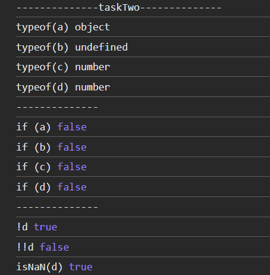

## Вопрос №2

### Вопрос

1) В чем разница между Null, NaN и undefined?

### Ответ

1) [stackoverflow](https://stackoverflow.com/questions/50320711/what-is-the-difference-between-null-nan-and-undefined-in-javascript)
1) [medium](https://medium.com/@stheodorejohn/null-nan-and-undefined-understanding-absence-and-invalidity-in-javascript-5ebd3fa918ee)
1) [Типы данных](https://learn.javascript.ru/types)

NaN: Not a number: Как следует из названия, оно используется для обозначения того, что значение объекта не является числом. Существует множество способов, которыми вы можете сгенерировать эту ошибку, одним из которых являются недопустимые математические операции, такие как 0/0 или sqrt(-1)

undefined: Это означает, что объект не имеет никакого значения, следовательно, не определен. Это происходит, когда вы создаете переменную и не присваиваете ей значение.

null: Это означает, что объект пуст и не указывает ни на какой адрес в памяти.

### задача

```javascript

    let a = null;
    let b = undefined;
    let c = 0;
    let d = NaN;

    console.log(typeof(a));
    console.log(typeof(b));
    console.log(typeof(c));
    console.log(typeof(d)); 

    console.log('--------------')

    if (a) { console.log(true) } else { console.log(false) }
    if (b) { console.log(true) } else { console.log(false) }
    if (c) { console.log(true) } else { console.log(false) }
    if (d) { console.log(true) } else { console.log(false) }

    console.log('--------------')

    console.log(`!d`, !d);
    console.log(`!!d`, !!d);
    console.log(`isNaN(d)`, isNaN(d));

```

