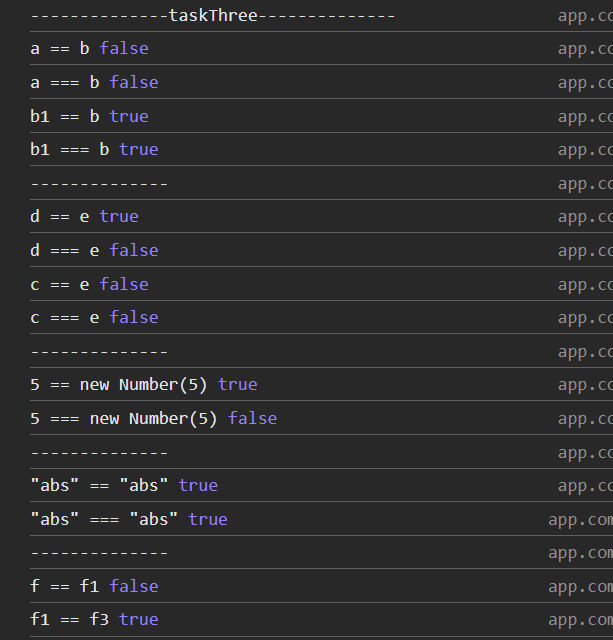

## Вопрос №3

### Вопрос

В чем разница между "==" и "==="?

### Ответ

1) [Нестрогое равенство](https://developer.mozilla.org/ru/docs/Web/JavaScript/Reference/Operators/Equality)
2) [Строгое равенство](https://developer.mozilla.org/ru/docs/Web/JavaScript/Reference/Operators/Strict_equality)

"==" выполняет произвольную операцию равенства между своими операндами и вводит принудительный тип.
Это означает, что если вы используете "==" между двумя значениями разных типов, JavaScript пытается преобразовать тип одного операнда в тип другого, чтобы получить результат.

В то время как "===" выполняет строгое равенство и не пытается преобразовать тип любого значения. Он проверяет, совпадают ли типы значений. В противном случае возвращается false.

### задача

```javascript

    let a: any = "6";
    let b: any = "3";
    let b1 = b;
    console.log(`a == b`, a == b);
    console.log(`a === b`, a === b);
    console.log(`b1 == b`, b1 == b);
    console.log(`b1 === b`, b1 === b);

    console.log('--------------')

    let d = null;
    let e = undefined;
    let c = 0;
    console.log(`d == e`, d == e);
    console.log(`d === e`, d === e);
    console.log(`c == e`, c == e);
    console.log(`c === e`, c === e);

    console.log('--------------')

    console.log(`5 == new Number(5)`, 5 == new Number(5));
    console.log(`5 === new Number(5)`, 5 === new Number(5));

    console.log('--------------')

    console.log(`"abs" == "abs"`, "abs" == "abs");
    console.log(`"abs" === "abs"`, "abs" === "abs");

    console.log('--------------')

    let f = { name: "aaa" };
    let f1 = { name: "aaa" };
    let f3 = f1;
    console.log(`f == f1`, f == f1);
    console.log(`f1 == f3`, f1 == f3);

```

