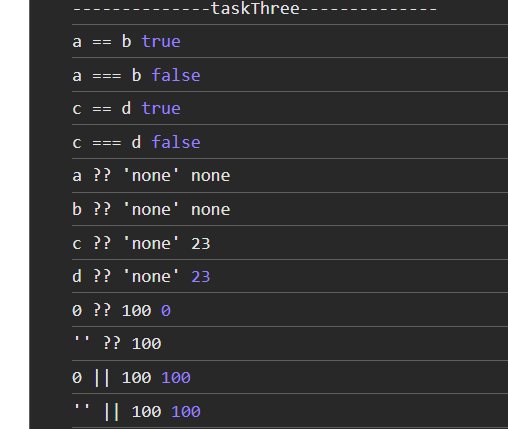

## Вопрос №3

### Вопрос

1) В чем разница между "==" и "==="?
2) Оператор нулевого слияния (??)

### Ответ

1) [Нестрогое равенство](https://developer.mozilla.org/ru/docs/Web/JavaScript/Reference/Operators/Equality)
2) [Строгое равенство](https://developer.mozilla.org/ru/docs/Web/JavaScript/Reference/Operators/Strict_equality)
3) [Оператор нулевого слияния (??)](https://doka-guide.vercel.app/js/typecasting/)

"==" выполняет произвольную операцию равенства между своими операндами и вводит принудительный тип.
Это означает, что если вы используете "==" между двумя значениями разных типов, JavaScript пытается преобразовать тип одного операнда в тип другого, чтобы получить результат.

В то время как "===" выполняет строгое равенство и не пытается преобразовать тип любого значения. Он проверяет, совпадают ли типы значений. В противном случае возвращается false.

оператор ?? возвращает первый аргумент, если он не null/undefined, иначе второй.

### задача

```javascript

    let a = null;
    let b = undefined; 
    console.log(a == b);
    console.log(a === b); 

    let c = '23';
    let d: any = 23; 
    console.log(c == d);
    console.log(c === d); 

    console.log(a ?? 'none');
    console.log(b ?? 'none');
    console.log(c ?? 'none');
    console.log(d ?? 'none');

    console.log(0 ?? 100);
    console.log('' ?? 100);
    console.log(0 || 100);
    console.log('' || 100);

```

