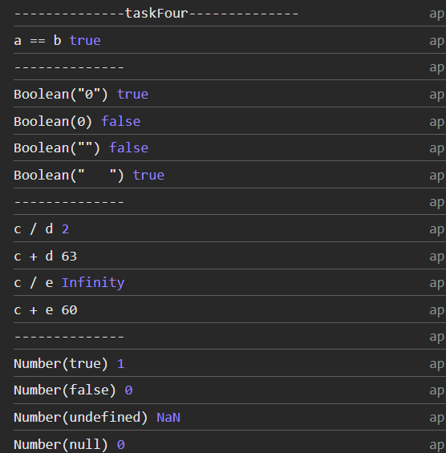

## Вопрос №4

### Вопрос

1) Какие способы преобразвоания типов вы знаете?

### Ответ

1) [Преобразование типов](https://learn.javascript.ru/type-conversions)
2) [Преобразование типов + Типы данных](https://doka-guide.vercel.app/js/typecasting/)

1) Явное преобразование (происходит когда мы сами преобразовываем типы)
2) Неявное преобразвоание (происходит, когда мы заставляем JavaScript работать со значениями разных типов)

1) .toString()
2) `+`
3) `+ ''`
4) Number()
5) Boolean()
6) String()

### задача

```javascript

    let a = Number.MAX_VALUE + 1;
    let b = Number.MAX_VALUE + 2;
    console.log(`a == b`, a == b);

    console.log('--------------')

    console.log(`Boolean("0")`, Boolean("0"));
    console.log(`Boolean(0)`, Boolean(0));
    console.log(`Boolean("")`, Boolean(""));
    console.log(`Boolean("   ")`, Boolean("   "));

    console.log('--------------')

    let c: any = "6";
    let d: any = "3";
    let e = 0; 
    console.log(`c / d`, c / d);
    console.log(`c + d`, c + d); 
    console.log(`c / e`, c / e);
    console.log(`c + e`, c + e);

```

