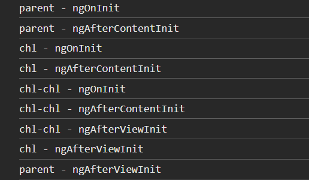

## Вопрос №9

### Вопрос 

1) Что такое компоненты, для чего нужны и как используются?
2) Как найти дочерние компоненты через общий класс?
3) Какие знаете способы передачи информации между компонентами?
4) Что такое `standalone` компоненты и зачем они нужны?

1) Что будет если если убрать @Component({ template: `` }) ?
2) Обязательно ли использовать именно @Component
3) Если убрать из implements будут ли вызываться методы?

### Ответ

1) [Anatomy of a component](https://angular.dev/guide/components)
2) [standalone](https://angular.dev/guide/components/importing)
3) [xxxxxx](xxxxxxx)

1) @Input()
2) @Output() и EventEmitter
3) ViewChild
4) Через сервис

### задача

```javascript

 @Component({ template: `` })
class BaseComponent implements OnInit, AfterViewInit, AfterContentInit, OnChanges {
    protected name!: string;
    ngOnInit(): void { console.log(`${this.name} - ngOnInit`); }
    ngAfterViewInit(): void { console.log(`${this.name} - ngAfterViewInit`); }
    ngAfterContentInit(): void { console.log(`${this.name} - ngAfterContentInit`); }
    ngOnChanges(_changes: SimpleChanges): void { console.log(`${this.name} - ngOnChanges`); }
}
 
@Component({
    selector: 'app-cmp-par',
    template: `<app-cmp-chl></app-cmp-chl>`
})
export class CmpParComponent extends BaseComponent {
    constructor() { super(); this.name = 'parent' }
}

@Component({
    selector: 'app-cmp-chl',
    template: `<app-cmp-chl-chl></app-cmp-chl-chl>`
})
export class CmpChlComponent extends BaseComponent {
    constructor() { super(); this.name = 'chl' }
}

@Component({
    selector: 'app-cmp-chl-chl',
    template: `<p>cmp-chl-chl works!</p>`
})
export class CmpChlChlComponent extends BaseComponent {
    constructor() { super(); this.name = 'chl-chl' }
}

```

