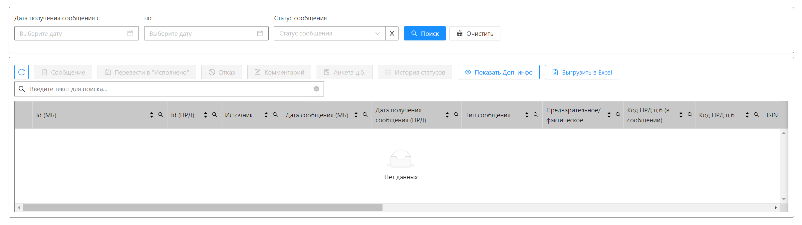

## Вопрос №17

### Вопрос 

1) Как бы реализовали прелоадер для формы?
2) Как бы вы згаружали конфигурационыне файлы для приложения?
3) Как бы вы организовали последовательную отправку запросов?
4) Как бы вы декомпозировали форму на компоненты? (Форма: таблица, с отдельными фильтрами и кнопка управления)
5) Как бы вы реализовали покрытие id элементов для тестов?

